# codeflix-c4

## Microservices Diagram

### Mermaid

```mermaid
C4Context
    title "Codeflix: Projeto Prático do Curso Full Cycle"

    Person(administrador_catalogo, "Administrador do catálogo de vídeos", "Gerencia os vídeos do catálogo e suas categorias")
    Person(administrador_assinantes, "Administrador dos assinantes", "Gerencia os assinantes do sistema, bem como os planos de assinatura")
    Person(assinante, "Assinante da plataforma", "Assina a plataforma para ter acesso aos vídeos")

    Boundary(gateway, "Codeflix") {
        Container(frontend_catalogo_admin, "Frontend: Admin do Catálogo de Vídeos", "React", "SPA que gerencia os vídeos, incluindo as categorias e gêneros")
        Container(backend_catalogo_admin, "Backend: Admin do Catálogo de Vídeos", "Linguagem livre", "Gerencia o catálogo de vídeos, incluindo as categorias e gêneros")
        ContainerDb(backend_catalogo_admin_database, "Database Admin do Catálogo de Vídeos", "MySQL", "Armazena dados do catálogo de vídeos")

        Container(encoder, "Encoder de vídeos", "Go", "Realiza o encoding dos vídeos para mpeg-dash")
        Container(bucket_videos, "Bucket de armazenamento de vídeos encodados", "GCP")
        Container(bucket_videos_raw, "Bucket de armazenamento de vídeos raw", "GCP")

        Container(frontend_catalogo, "Frontend do catálogo de vídeos", "React", "Disponibiliza a navegação e o playback dos vídeos para os assinantes")
        Container(api_catalogo, "API do Catálogo de Vídeos", "Linguagem livre", "Disponibiliza os endpoints para a navegação e playback dos vídeos")
        ContainerDb(elasticsearch_api_catalogo, "Database API do Catálogo", "Elasticsearch", "Armazena dados dos vídeos, gêneros, cast members e categorias")
        Container(apache_kafka, "Apache Kafka", "Message Broker", "Armazena e serve dados vindos do kafka Connect")
        Container(kafka_connect, "Kafka Connect", "Integração de dados", "Serviço de replicação de dados do catálogo")

        Container(assinatura, "Assinatura", "Linguagem livre", "Gerencia planos e assinaturas dos assinantes")
        ContainerDb(assinatura_postgres, "Database de Assinaturas", "Postgres", "Armazena dados dos assinantes e seus planos")

        Container(keycloak, "Keycloak", "Serviço de Identidade", "Realiza a autenticação de todos usuários da plataforma")
    }

    Rel(administrador_catalogo, frontend_catalogo_admin, "Interage com via", "HTTPS")
    Rel(administrador_assinantes, assinatura, "Interage com", "HTTPS")
    Rel(assinante, assinatura, "Interage com via", "HTTPS")
    Rel(assinante, keycloak, "Interage com via", "HTTPS")
    Rel(assinante, frontend_catalogo, "Interage com via", "HTTPS")

    Rel(frontend_catalogo_admin, backend_catalogo_admin, "Interage com via", "HTTPS/JSON")
    Rel(frontend_catalogo_admin, keycloak, "Se autentica em", "HTTPS")
    Rel(backend_catalogo_admin, backend_catalogo_admin_database, "Interage com usando", "TCP")
    Rel(backend_catalogo_admin, bucket_videos_raw, "Faz upload do vídeo raw via", "HTTPS")

    Rel(encoder, bucket_videos, "Faz upload do vídeo converted via", "HTTPS")
    Rel(encoder, bucket_videos_raw, "Faz download do vídeo raw via", "HTTPS")

    Rel(encoder, backend_catalogo_admin, "Consome dados do vídeo recém-criado via", "RabbitMQ Fila videos.new")
    Rel(encoder, backend_catalogo_admin, "Publica que vídeo foi convertido via", "RabbitMQ Fila videos.converted")
    Rel(backend_catalogo_admin, encoder, "Consome dados do vídeo convertido via", "RabbitMQ Fila videos.converted")
    Rel(backend_catalogo_admin, encoder, "Publica que novo vídeo foi enviado para o bucket raw via", "RabbitMQ Fila videos.new")

    Rel(frontend_catalogo, api_catalogo, "Interage com via", "HTTPS/JSON")
    Rel(api_catalogo, elasticsearch_api_catalogo, "Interage com via", "HTTPS/JSON")

    Rel(kafka_connect, elasticsearch_api_catalogo, "Envia dados do catálogo de vídeos via", "Sink Elasticsearch")
    Rel(kafka_connect, backend_catalogo_admin_database, "Copia dados usando connector", "Debezium MySQL")
    Rel(kafka_connect, apache_kafka, "Interage com via", "Protocolo Kafka")

    Rel(assinatura, assinatura_postgres, "Interage com via", "Protocolo Postgres")
    Rel(assinatura, keycloak, "Interage com via", "HTTPS")
```

### How to render locally
You can use the [PlantUML extension](https://marketplace.visualstudio.com/items?itemName=jebbs.plantuml) for VS Code to preview the `microservices.puml` file.
